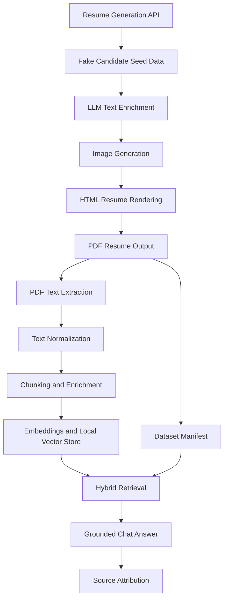

# CV Asker Architecture

This document describes the current implementation and the planned PDF-only RAG pipeline.

## Source Of Truth

- The original company requirements PDF is kept locally at `.local/requirements/ai-full-stack-developer-business-case.pdf`.
- That file is intentionally excluded from git tracking.
- The repository-ready requirements summary lives in `docs/project-requirements.md`.
- RAG ingestion must read and parse generated PDF resumes directly.

## Architecture Diagram

## Flow Notes

1. Resume generation produces the candidate PDFs and a lightweight dataset manifest.
2. The RAG pipeline starts from the PDFs only, not from hidden structured resume JSON.
3. Text extraction uses a local PDF parsing command-line tool.
4. Normalization converts noisy PDF output into cleaner paragraph text for section parsing and chunking.
5. Section parsing uses bilingual heading heuristics to derive summary, experience, education, language, and certification blocks from parsed PDF text.
6. Retrieval will combine semantic ranking with manifest-backed document selection and source references.

## Extraction Criteria

1. PDF text is extracted with layout preservation so visually adjacent lines remain close enough for later heuristics.
2. The normalizer repairs line wraps, removes PDF whitespace noise, and rebuilds paragraphs before any semantic classification happens.
3. Each paragraph or sub-block is scored with lightweight signals:
   contact: email, phone, URLs, contact labels
   experience: date ranges, role-at-company patterns, action verbs
   education: degrees, institutions, academic keywords
   languages: language plus proficiency pairs
   certifications: certification keywords
   skills: dense short lists of tools or capabilities
4. If a single experience block actually contains several jobs because of the PDF layout, the structured extractor splits it again when a new paragraph introduces another date range.
5. A `Skills` or `Technologies` block immediately following an experience block is linked back to that experience entry as associated skills.
6. These rules are format-agnostic on purpose, so they can generalize beyond software CVs to operational, administrative, industrial, or retail profiles.
