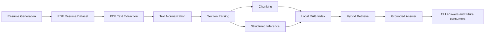

# CV Asker Architecture

This document describes the implemented end-to-end flow of CV Asker.

## Core Rule

- The PDF is the source of truth for RAG ingestion.
- Derived CV metadata is not used as an ingestion input.
- The original requirements PDF is stored locally at `.local/requirements/ai-full-stack-developer-business-case.pdf` and excluded from git.

## System Diagram

## Runtime Flow

1. A local batch of fake resumes is generated as PDFs.
2. The PDFs are parsed directly with a local text-extraction tool.
3. The extracted text is normalized to reduce layout noise.
4. The normalized text is split into sections such as summary, experience, education, languages, and skills.
5. Those sections are chunked and combined with structured signals inferred from the same PDF text.
6. A local searchable index is built from chunks plus inferred candidate facets.
7. User questions are answered through hybrid retrieval and grounded response generation, with source excerpts attached.

## Retrieval Model

The current RAG layer combines:

- local hashed-vector similarity over chunk text
- lexical overlap on query terms
- lightweight structured filters such as languages and minimum experience
- section-aware boosts for experience, education, certifications, and skills

If the remote LLM is unavailable, the system returns a deterministic local fallback answer instead of failing hard.

## Parsing Strategy

The parser is heuristic-based and intentionally generic.

It relies on:

- bilingual heading aliases
- date-range detection
- contact-pattern detection
- education and certification keywords
- language-plus-level pairs
- action-oriented work-history verbs

This is meant to generalize beyond software CVs, although very unusual PDF layouts may still need tuning.

## Main Configuration

The main product configuration lives in:

- `src/config/resume-generation.ts`

That file centralizes:

- resume generation defaults
- fallback text-generation models
- image-generation settings
- RAG answer model
- retry and timeout settings
